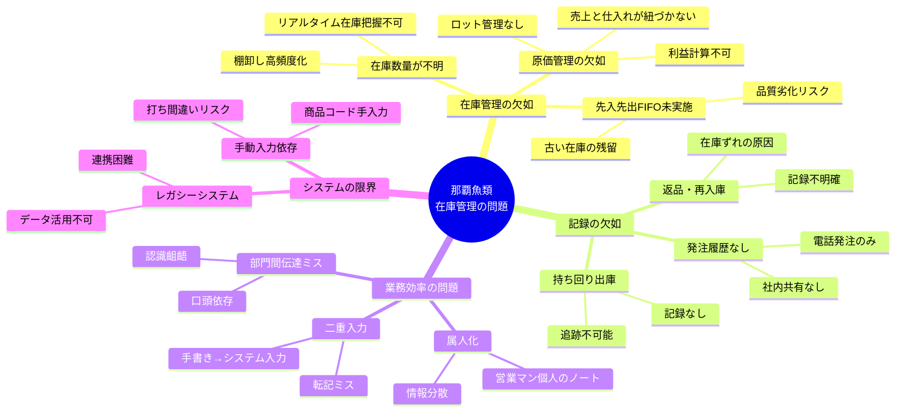
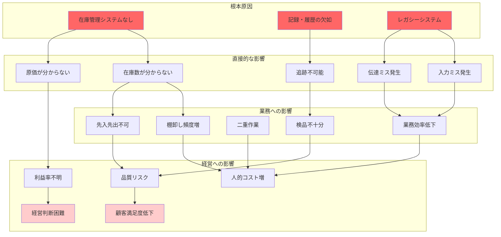
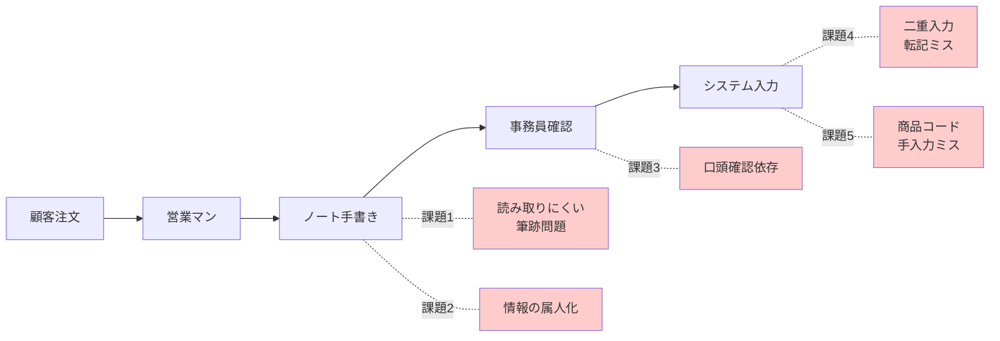
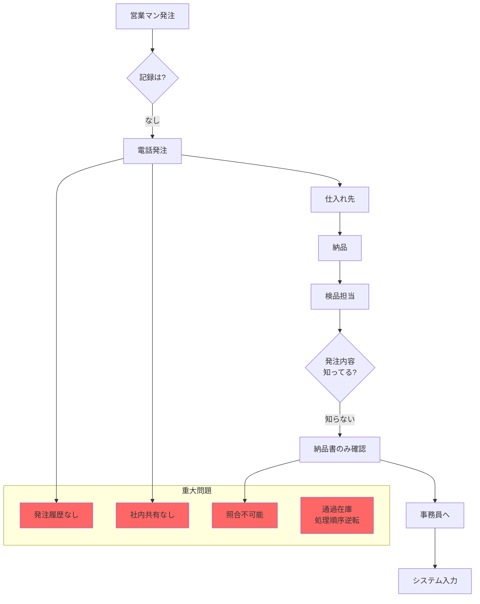
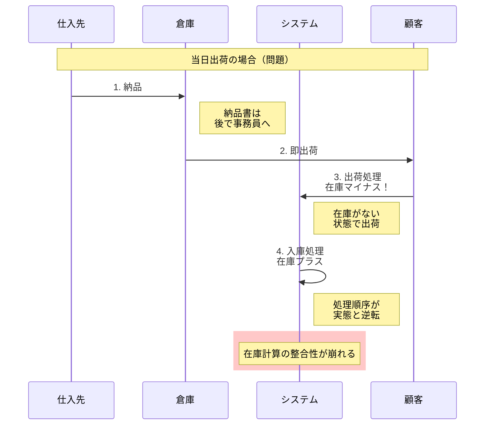
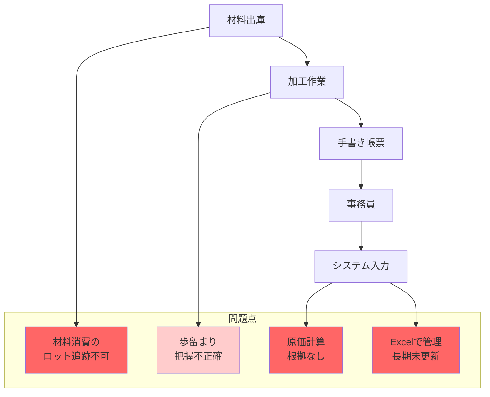
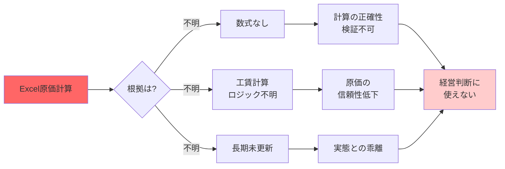
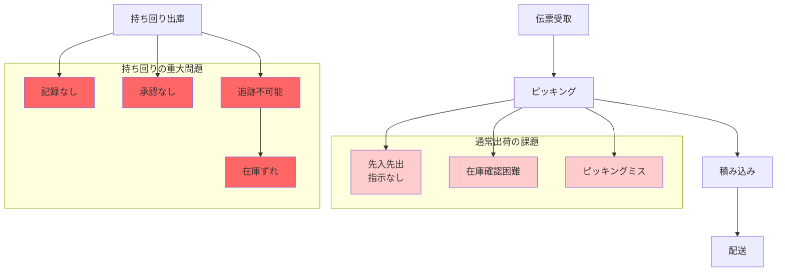
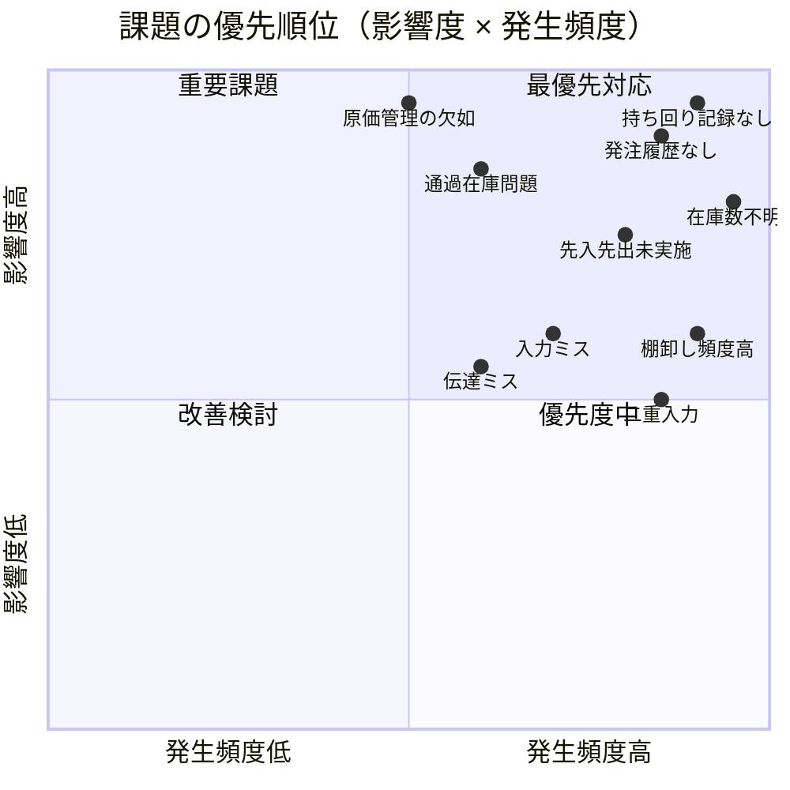
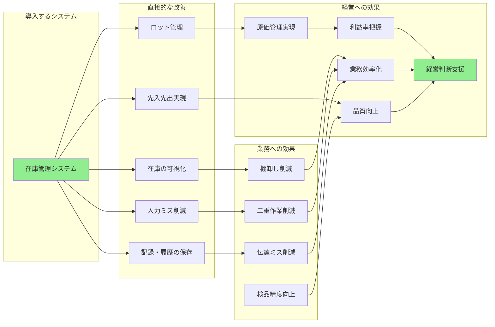

# 現状の問題点マップ

## 問題の全体像

## 問題の影響範囲マップ

## 業務別の課題詳細

### 1. 受注業務の課題

### 2. 入庫業務の課題

#### 通過在庫問題の詳細

### 3. 加工業務の課題

#### 加工原価管理の問題

### 4. 出荷業務の課題

## 問題の優先順位マトリクス

## 問題解決の期待効果

## 課題の色分け凡例

- 🔴 **赤色（濃）**: 重大な問題（記録なし、追跡不可能、経営に直結）
- 🟠 **赤色（薄）**: 改善必要（業務効率、品質に影響）
- 🟢 **緑色**: 改善後の状態、ポジティブな効果
