# 在庫フロー図

## 在庫の動きの全体像

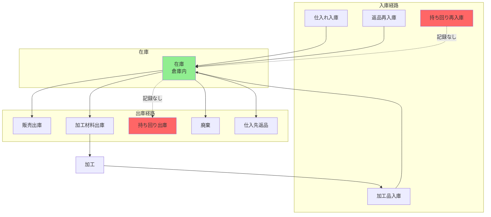

## 詳細在庫フロー（現状）

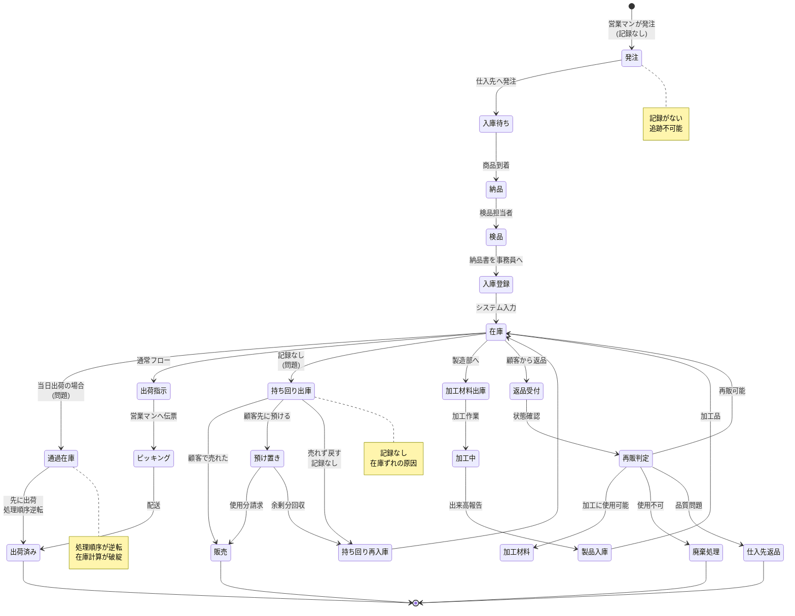

## ロット管理と先入先出（理想）

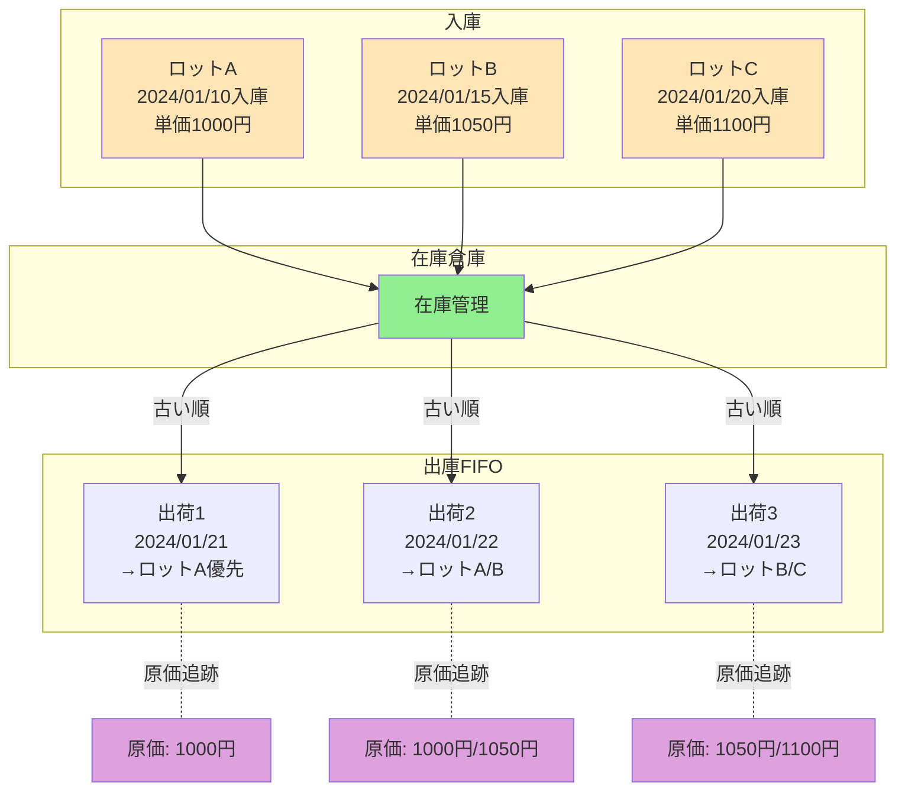

## 在庫精度の問題（現状 vs 理想）

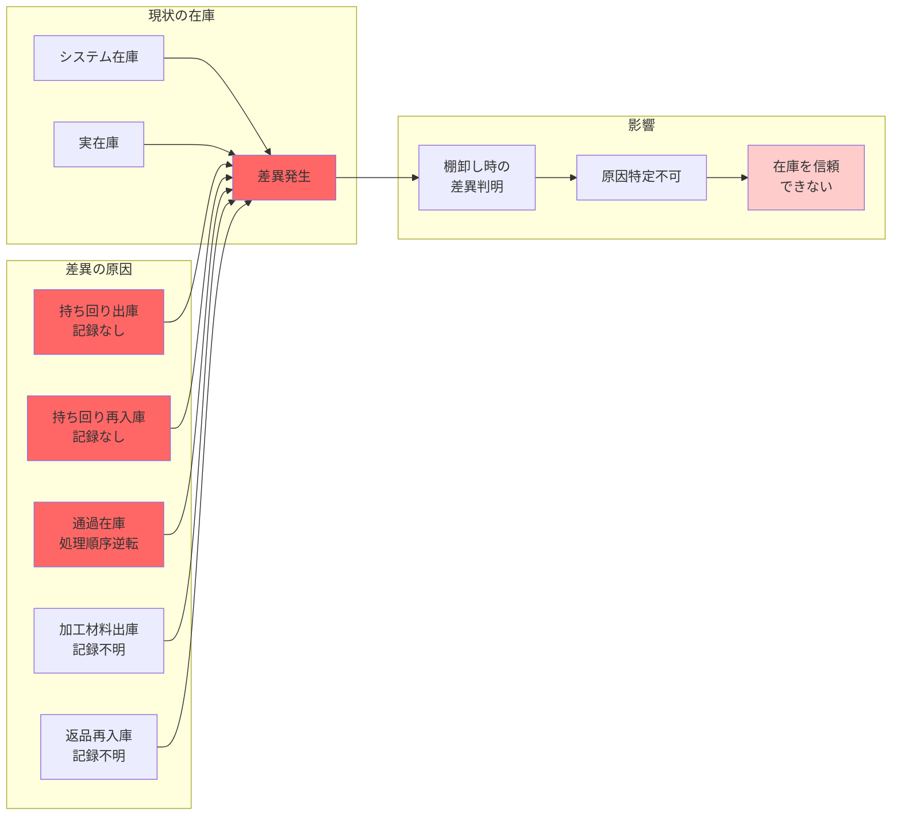

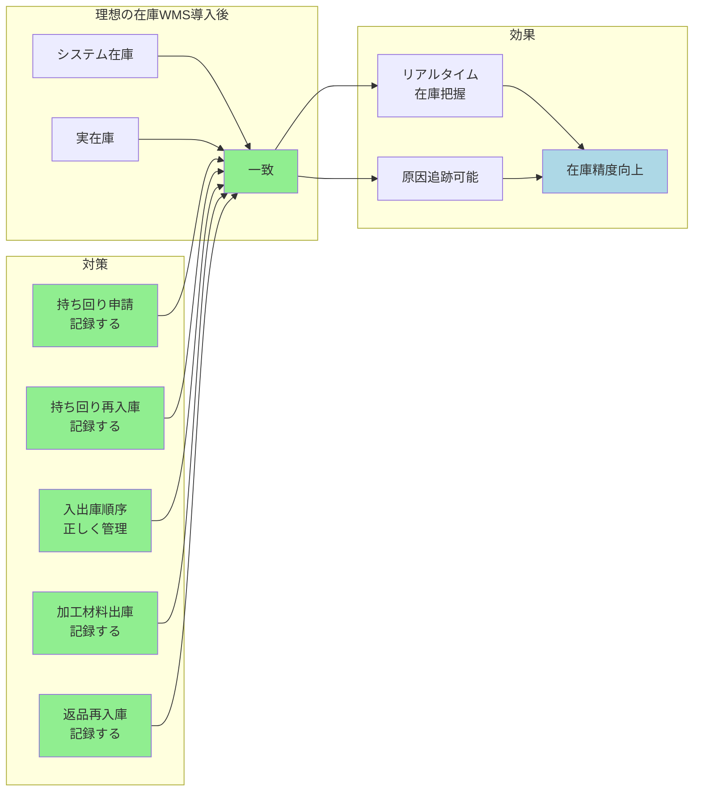

## 加工業務の在庫フロー

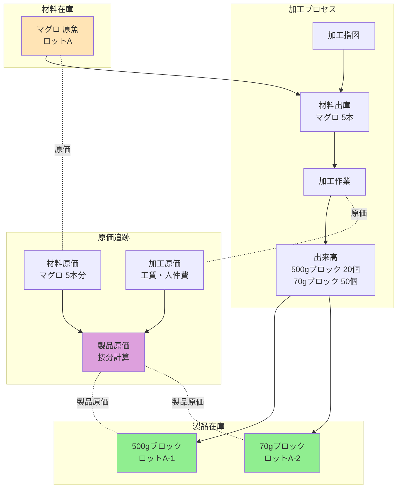

### 現状の加工原価管理の問題

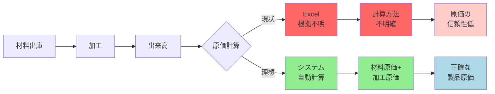

## 返品・再入庫フロー

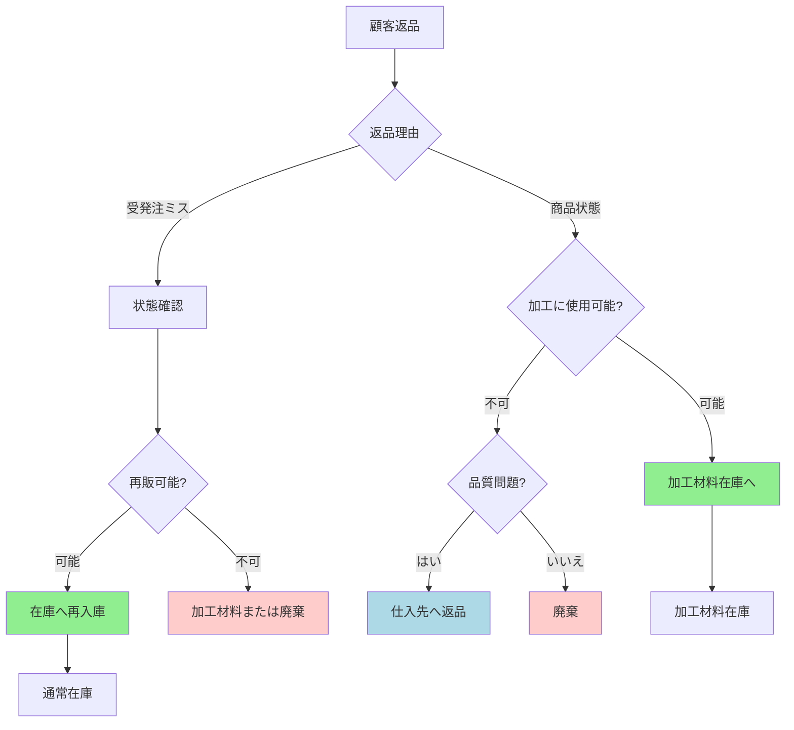

## 持ち回り在庫の追跡（現状 vs 理想）

### 現状: 追跡不可能

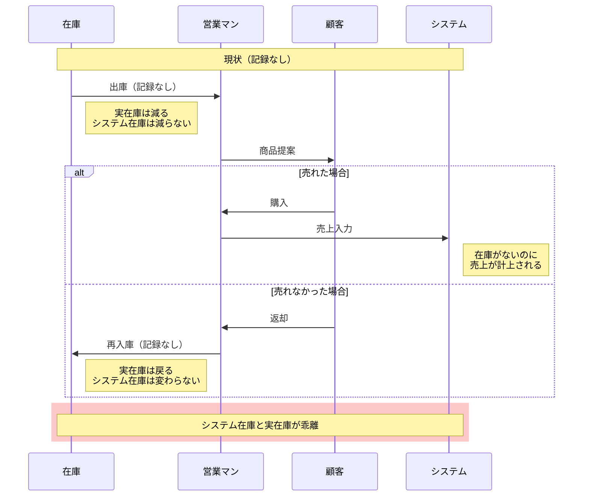

### 理想: WMSで追跡

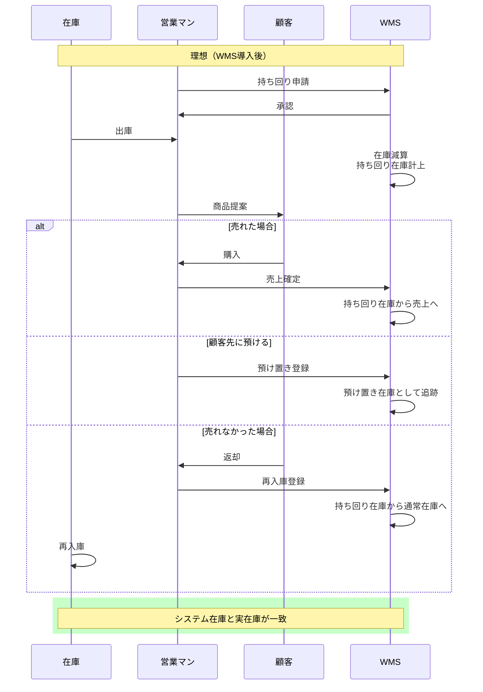

## 在庫KPI（導入前後の比較）

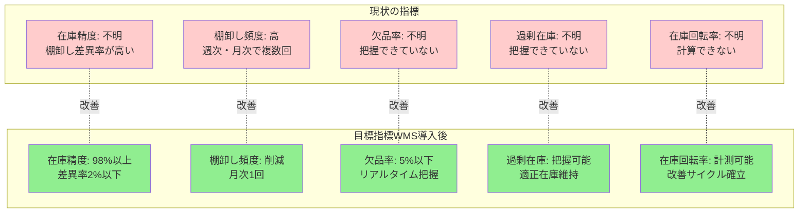

## 在庫可視化ダッシュボード（想定）

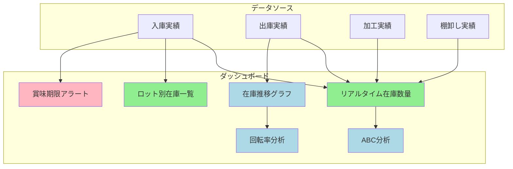

## まとめ: 在庫管理の改善方向

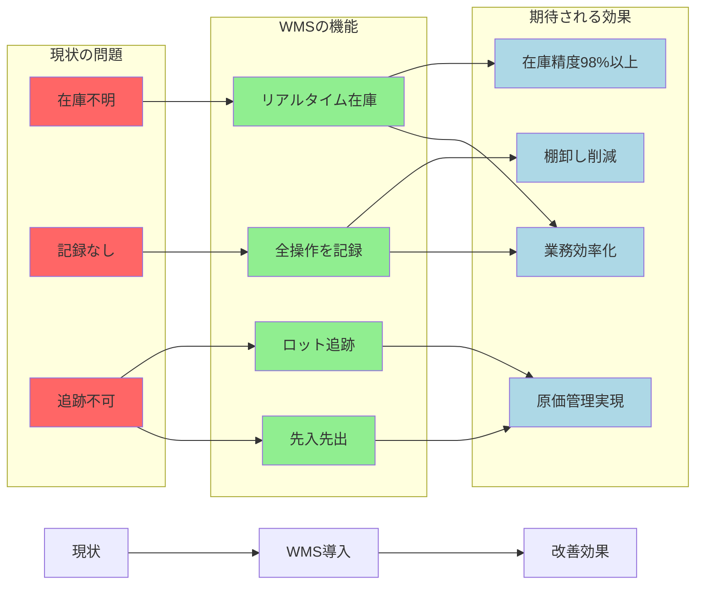
