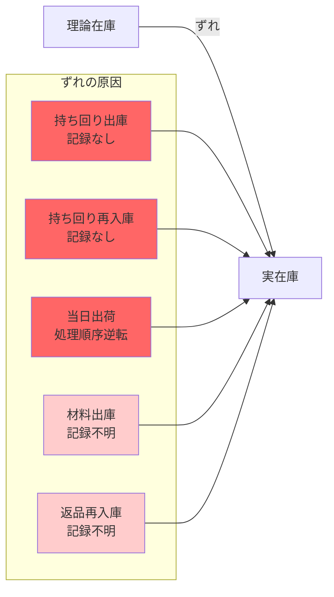

# 那覇魚類 全体業務フロー図

## 現状の業務フロー全体像

```mermaid
graph TB
    subgraph 受注業務
        A1[顧客から注文] --> A2[営業マン]
        A2 --> A3[ノートに手書き]
        A3 --> A4[事務員がノート確認]
        A4 --> A5[販売管理システム入力]
        A5 --> A6[伝票印刷]
    end

    subgraph 発注・入庫業務
        B1[営業マンが発注<br/>電話等で記録なし] --> B2[仕入れ先]
        B2 --> B3[商品納品]
        B3 --> B4[検品担当者が受取]
        B4 --> B5[納品書を事務員へ]
        B5 --> B6[販売管理システムに入庫登録]
        B6 --> B7[在庫増加]
    end

    subgraph 加工業務
        C1[製造部が材料出庫] --> C2[加工作業<br/>マグロ→ブロック等]
        C2 --> C3[手書き帳票に記録]
        C3 --> C4[事務員へ帳票]
        C4 --> C5[販売管理システム入力]
        C5 --> C6[製品在庫増加]
    end

    subgraph 出荷業務
        D1[伝票手渡し] --> D2[営業マンが確認]
        D2 --> D3[倉庫でピッキング]
        D3 --> D4[トラック積み込み]
        D4 --> D5[顧客へ配送]
        D5 --> D6[在庫減少]
    end

    subgraph 持ち回り未記録フロー
        E1[営業マンが独断で出庫<br/>記録なし] --> E2[顧客へ提案]
        E2 --> E3{結果}
        E3 -->|販売| E4[売上計上]
        E3 -->|預け置き| E5[顧客先に保管]
        E3 -->|売れず| E6[再入庫<br/>記録なし]
    end

    A6 --> D1
    B7 -.在庫.- D3
    C6 -.在庫.- D3

    style A3 fill:#ffcccc
    style B1 fill:#ffcccc
    style C3 fill:#ffcccc
    style E1 fill:#ff6666
    style E6 fill:#ff6666
```

## 業務フローの特徴

### 1. 受注から出荷まで営業マンが一貫担当
- 営業マンが受注、場合によっては発注も担当
- 同じ営業マンが出荷・配送も担当
- 顧客担当制で一貫した対応

### 2. 紙とレガシーシステムの併用
- ノート手書き → システム入力の二重作業
- 伝票は複写式の紙（ターンアラウンド１型）
- 事務員が介在して入力

### 3. 記録されない業務フロー（重大問題）
- **発注履歴がない**: 営業マンの電話発注は記録なし
- **持ち回りが追えない**: 出庫・再入庫が記録されない
- **加工原価が不透明**: Excel管理だが根拠不明

## 在庫管理上の問題点



## 部門間の情報伝達

```mermaid
graph TB
    subgraph 営業部
        A1[受注情報<br/>個人ノート]
        A2[発注情報<br/>記録なし]
        A3[持ち回り<br/>記録なし]
    end

    subgraph 事務部
        B1[ノート確認]
        B2[システム入力]
        B3[伝票作成]
    end

    subgraph 倉庫・製造部
        C1[検品・入庫]
        C2[加工実績<br/>手書き帳票]
        C3[ピッキング]
    end

    A1 -->|手書き| B1
    B1 --> B2
    B2 --> B3
    B3 -->|紙伝票| C3
    C2 -->|手書き| B2

    style A2 fill:#ff6666
    style A3 fill:#ff6666

    note1[情報が記録されず共有されない]
    style note1 fill:#fff9e6
```

## 課題の色分け凡例

- 🔴 **赤色（濃）**: 重大な問題（記録が存在しない、追跡不可能）
- 🟠 **赤色（薄）**: 改善が必要な問題（手書き、転記ミスリスク）
- ⚪ **白色**: 正常なフロー
