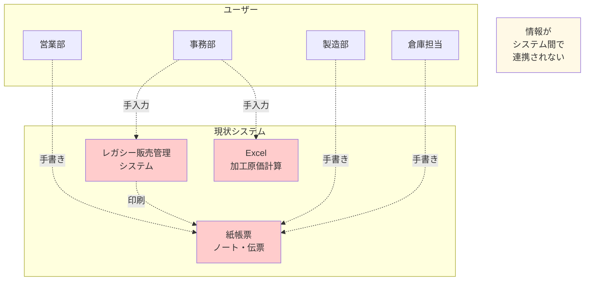
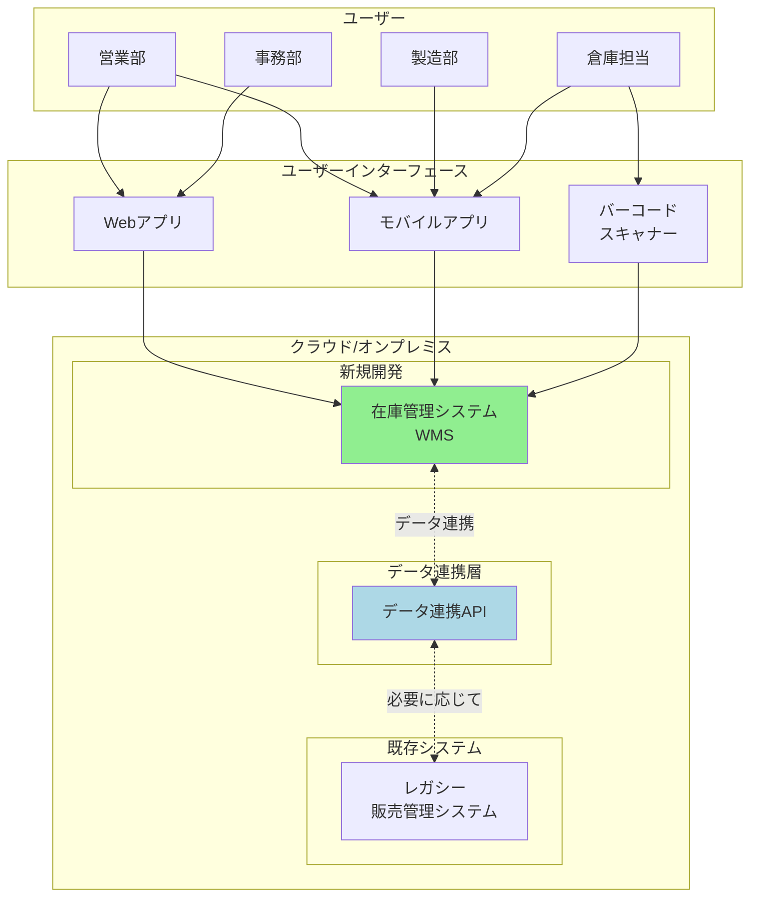
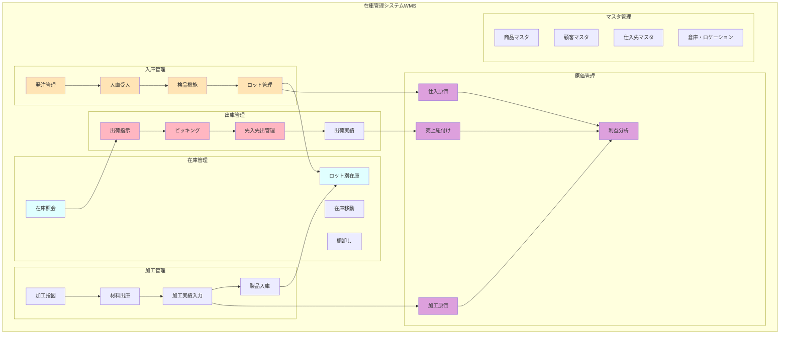
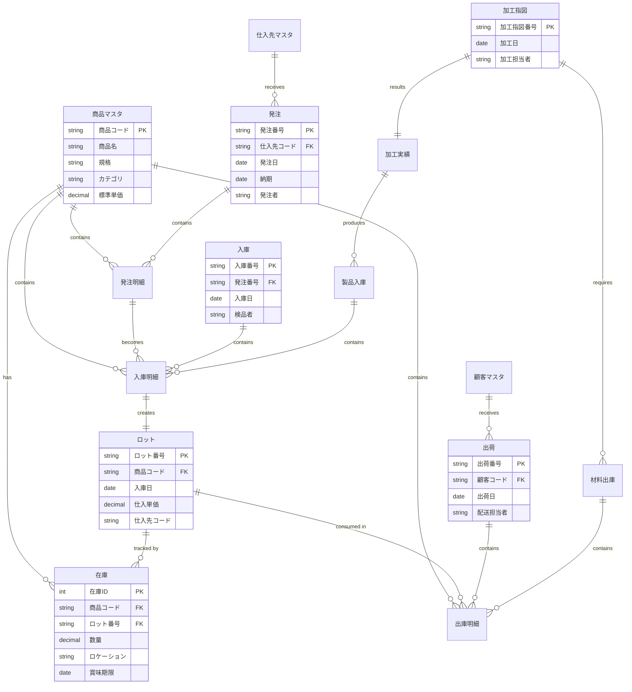
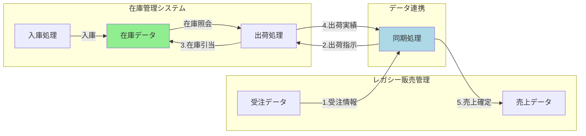
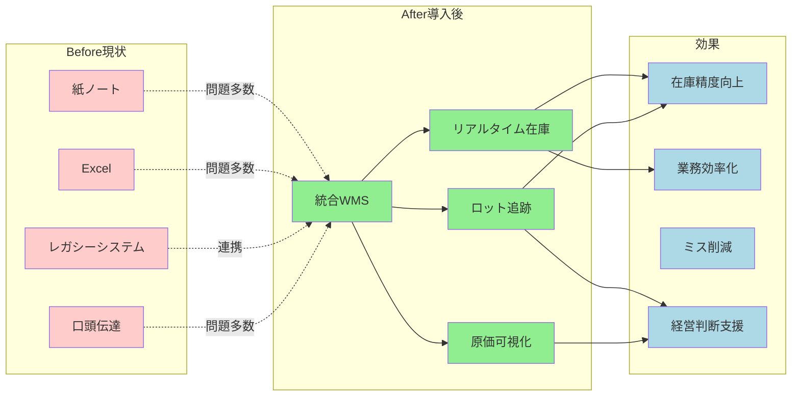
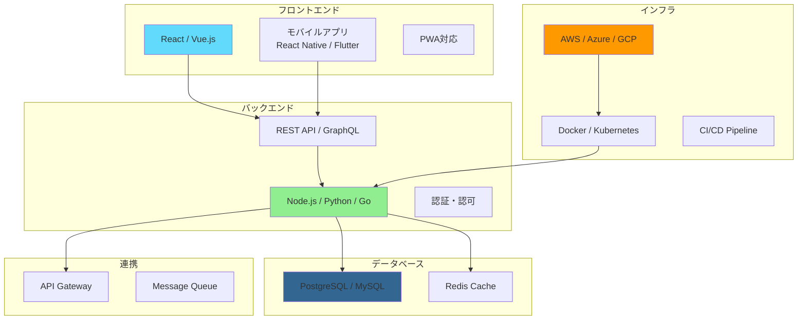
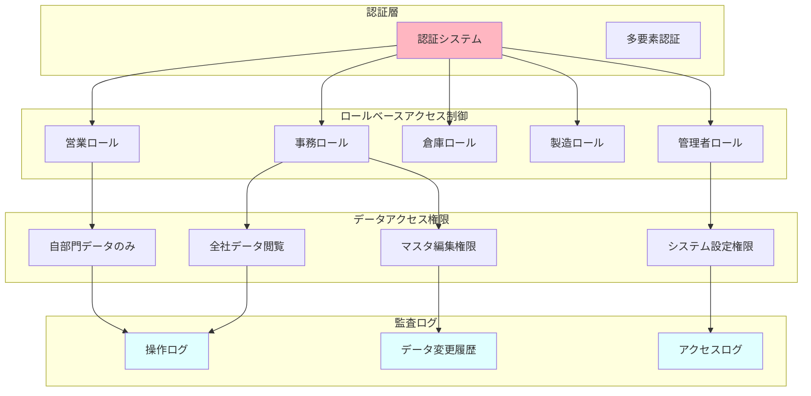

# システムアーキテクチャ図

## 現状のシステム構成

```mermaid
graph TB
    subgraph 現状システム
        L1[レガシー販売管理<br/>システム]
        L2[Excel<br/>加工原価計算]
        L3[紙帳票<br/>ノート・伝票]
    end

    subgraph ユーザー
        U1[営業部]
        U2[事務部]
        U3[製造部]
        U4[倉庫担当]
    end

    U1 -.手書き.-> L3
    U2 -.手入力.-> L1
    U2 -.手入力.-> L2
    U3 -.手書き.-> L3
    U4 -.手書き.-> L3

    L1 -.印刷.-> L3

    Note1[情報が<br/>システム間で<br/>連携されない]

    style L1 fill:#ffcccc
    style L2 fill:#ffcccc
    style L3 fill:#ffcccc
    style Note1 fill:#fff9e6
```

## 新システムの構成（案）

```mermaid
graph TB
    subgraph クラウド/オンプレミス
        subgraph 新規開発
            WMS[在庫管理システム<br/>WMS]
        end

        subgraph 既存システム
            Legacy[レガシー<br/>販売管理システム]
        end

        subgraph データ連携層
            API[データ連携API]
        end
    end

    subgraph ユーザーインターフェース
        Web[Webアプリ]
        Mobile[モバイルアプリ]
        Barcode[バーコード<br/>スキャナー]
    end

    subgraph ユーザー
        U1[営業部]
        U2[事務部]
        U3[製造部]
        U4[倉庫担当]
    end

    U1 --> Web
    U1 --> Mobile
    U2 --> Web
    U3 --> Mobile
    U4 --> Mobile
    U4 --> Barcode

    Web --> WMS
    Mobile --> WMS
    Barcode --> WMS

    WMS <-.データ連携.-> API
    API <-.必要に応じて.-> Legacy

    style WMS fill:#90EE90
    style API fill:#ADD8E6
```

## 在庫管理システム（WMS）機能構成

```mermaid
graph TB
    subgraph 在庫管理システムWMS
        subgraph 入庫管理
            R1[発注管理]
            R2[入庫受入]
            R3[検品機能]
            R4[ロット管理]
        end

        subgraph 在庫管理
            I1[在庫照会]
            I2[ロット別在庫]
            I3[在庫移動]
            I4[棚卸し]
        end

        subgraph 出庫管理
            S1[出荷指示]
            S2[ピッキング]
            S3[先入先出管理]
            S4[出荷実績]
        end

        subgraph 加工管理
            P1[加工指図]
            P2[材料出庫]
            P3[加工実績入力]
            P4[製品入庫]
        end

        subgraph 原価管理
            C1[仕入原価]
            C2[加工原価]
            C3[売上紐付け]
            C4[利益分析]
        end

        subgraph マスタ管理
            M1[商品マスタ]
            M2[顧客マスタ]
            M3[仕入先マスタ]
            M4[倉庫・ロケーション]
        end
    end

    R1 --> R2
    R2 --> R3
    R3 --> R4
    R4 --> I2

    I1 --> S1
    S1 --> S2
    S2 --> S3
    S3 --> S4

    P1 --> P2
    P2 --> P3
    P3 --> P4
    P4 --> I2

    R4 --> C1
    P3 --> C2
    S4 --> C3
    C1 --> C4
    C2 --> C4
    C3 --> C4

    style R1 fill:#FFE4B5
    style R2 fill:#FFE4B5
    style R3 fill:#FFE4B5
    style R4 fill:#FFE4B5
    style I1 fill:#E0FFFF
    style I2 fill:#E0FFFF
    style S1 fill:#FFB6C1
    style S2 fill:#FFB6C1
    style S3 fill:#FFB6C1
    style C1 fill:#DDA0DD
    style C2 fill:#DDA0DD
    style C3 fill:#DDA0DD
    style C4 fill:#DDA0DD
```

## データモデル（概念図）

```mermaid
erDiagram
    商品マスタ ||--o{ 在庫 : has
    商品マスタ ||--o{ 発注明細 : contains
    商品マスタ ||--o{ 入庫明細 : contains
    商品マスタ ||--o{ 出庫明細 : contains

    仕入先マスタ ||--o{ 発注 : receives
    顧客マスタ ||--o{ 出荷 : receives

    発注 ||--o{ 発注明細 : contains
    発注明細 ||--o{ 入庫明細 : "becomes"

    入庫 ||--o{ 入庫明細 : contains
    入庫明細 ||--|| ロット : creates

    ロット ||--o{ 在庫 : "tracked by"
    ロット ||--o{ 出庫明細 : "consumed in"

    出荷 ||--o{ 出庫明細 : contains

    加工指図 ||--o{ 材料出庫 : requires
    材料出庫 ||--o{ 出庫明細 : contains
    加工指図 ||--|| 加工実績 : results
    加工実績 ||--o{ 製品入庫 : produces
    製品入庫 ||--o{ 入庫明細 : contains

    商品マスタ {
        string 商品コード PK
        string 商品名
        string 規格
        string カテゴリ
        decimal 標準単価
    }

    在庫 {
        int 在庫ID PK
        string 商品コード FK
        string ロット番号 FK
        decimal 数量
        string ロケーション
        date 賞味期限
    }

    ロット {
        string ロット番号 PK
        string 商品コード FK
        date 入庫日
        decimal 仕入単価
        string 仕入先コード
    }

    発注 {
        string 発注番号 PK
        string 仕入先コード FK
        date 発注日
        date 納期
        string 発注者
    }

    入庫 {
        string 入庫番号 PK
        string 発注番号 FK
        date 入庫日
        string 検品者
    }

    出荷 {
        string 出荷番号 PK
        string 顧客コード FK
        date 出荷日
        string 配送担当者
    }

    加工指図 {
        string 加工指図番号 PK
        date 加工日
        string 加工担当者
    }
```

## システム間データフロー

```mermaid
graph LR
    subgraph 在庫管理システム
        WMS_IN[入庫処理]
        WMS_INV[在庫データ]
        WMS_OUT[出荷処理]
    end

    subgraph レガシー販売管理
        LEG_ORDER[受注データ]
        LEG_SALES[売上データ]
    end

    subgraph データ連携
        SYNC[同期処理]
    end

    LEG_ORDER -->|1.受注情報| SYNC
    SYNC -->|2.出荷指示| WMS_OUT
    WMS_OUT -->|3.在庫引当| WMS_INV
    WMS_OUT -->|4.出荷実績| SYNC
    SYNC -->|5.売上確定| LEG_SALES

    WMS_IN -->|入庫| WMS_INV
    WMS_INV -->|在庫照会| WMS_OUT

    style WMS_INV fill:#90EE90
    style SYNC fill:#ADD8E6
```

## ユーザー別アクセス機能

```mermaid
graph TB
    subgraph 営業部
        A1[受注確認]
        A2[在庫照会]
        A3[出荷状況確認]
        A4[持ち回り申請・記録]
        A5[顧客別売上]
    end

    subgraph 事務部
        B1[発注登録]
        B2[入庫登録]
        B3[出荷伝票発行]
        B4[マスタ管理]
        B5[帳票出力]
    end

    subgraph 倉庫担当
        C1[入庫検品]
        C2[ピッキング]
        C3[出庫実績入力]
        C4[棚卸し]
        C5[在庫移動]
    end

    subgraph 製造部
        D1[加工指図確認]
        D2[材料出庫]
        D3[加工実績入力]
        D4[製品入庫]
    end

    subgraph 経営層
        E1[在庫状況ダッシュボード]
        E2[原価分析]
        E3[利益分析]
        E4[KPIモニタリング]
    end

    WMS[在庫管理システム]

    A1 --> WMS
    A2 --> WMS
    A3 --> WMS
    A4 --> WMS
    A5 --> WMS

    B1 --> WMS
    B2 --> WMS
    B3 --> WMS
    B4 --> WMS
    B5 --> WMS

    C1 --> WMS
    C2 --> WMS
    C3 --> WMS
    C4 --> WMS
    C5 --> WMS

    D1 --> WMS
    D2 --> WMS
    D3 --> WMS
    D4 --> WMS

    E1 --> WMS
    E2 --> WMS
    E3 --> WMS
    E4 --> WMS

    style WMS fill:#90EE90
```

## システム導入効果のビフォーアフター

```mermaid
graph LR
    subgraph Before現状
        B1[紙ノート]
        B2[Excel]
        B3[レガシーシステム]
        B4[口頭伝達]
    end

    subgraph After導入後
        A1[統合WMS]
        A2[リアルタイム在庫]
        A3[ロット追跡]
        A4[原価可視化]
    end

    subgraph 効果
        E1[在庫精度向上]
        E2[業務効率化]
        E3[ミス削減]
        E4[経営判断支援]
    end

    B1 -.問題多数.-> A1
    B2 -.問題多数.-> A1
    B3 -.連携.-> A1
    B4 -.問題多数.-> A1

    A1 --> A2
    A1 --> A3
    A1 --> A4

    A2 --> E1
    A2 --> E2
    A3 --> E1
    A3 --> E4
    A4 --> E4

    style B1 fill:#ffcccc
    style B2 fill:#ffcccc
    style B3 fill:#ffcccc
    style B4 fill:#ffcccc
    style A1 fill:#90EE90
    style A2 fill:#90EE90
    style A3 fill:#90EE90
    style A4 fill:#90EE90
    style E1 fill:#ADD8E6
    style E2 fill:#ADD8E6
    style E3 fill:#ADD8E6
    style E4 fill:#ADD8E6
```

## 技術スタック（想定）

```mermaid
graph TB
    subgraph フロントエンド
        F1[React / Vue.js]
        F2[モバイルアプリ<br/>React Native / Flutter]
        F3[PWA対応]
    end

    subgraph バックエンド
        B1[Node.js / Python / Go]
        B2[REST API / GraphQL]
        B3[認証・認可]
    end

    subgraph データベース
        D1[PostgreSQL / MySQL]
        D2[Redis Cache]
    end

    subgraph インフラ
        I1[AWS / Azure / GCP]
        I2[Docker / Kubernetes]
        I3[CI/CD Pipeline]
    end

    subgraph 連携
        C1[API Gateway]
        C2[Message Queue]
    end

    F1 --> B2
    F2 --> B2
    B2 --> B1
    B1 --> D1
    B1 --> D2
    B1 --> C1

    I2 --> B1
    I1 --> I2

    style F1 fill:#61DAFB
    style B1 fill:#90EE90
    style D1 fill:#336791
    style I1 fill:#FF9900
```

## セキュリティとアクセス制御

```mermaid
graph TB
    subgraph 認証層
        Auth[認証システム]
        MFA[多要素認証]
    end

    subgraph ロールベースアクセス制御
        R1[営業ロール]
        R2[事務ロール]
        R3[倉庫ロール]
        R4[製造ロール]
        R5[管理者ロール]
    end

    subgraph データアクセス権限
        P1[自部門データのみ]
        P2[全社データ閲覧]
        P3[マスタ編集権限]
        P4[システム設定権限]
    end

    subgraph 監査ログ
        L1[操作ログ]
        L2[データ変更履歴]
        L3[アクセスログ]
    end

    Auth --> R1
    Auth --> R2
    Auth --> R3
    Auth --> R4
    Auth --> R5

    R1 --> P1
    R2 --> P2
    R2 --> P3
    R5 --> P4

    P1 --> L1
    P2 --> L1
    P3 --> L2
    P4 --> L3

    style Auth fill:#FFB6C1
    style L1 fill:#E0FFFF
    style L2 fill:#E0FFFF
    style L3 fill:#E0FFFF
```
