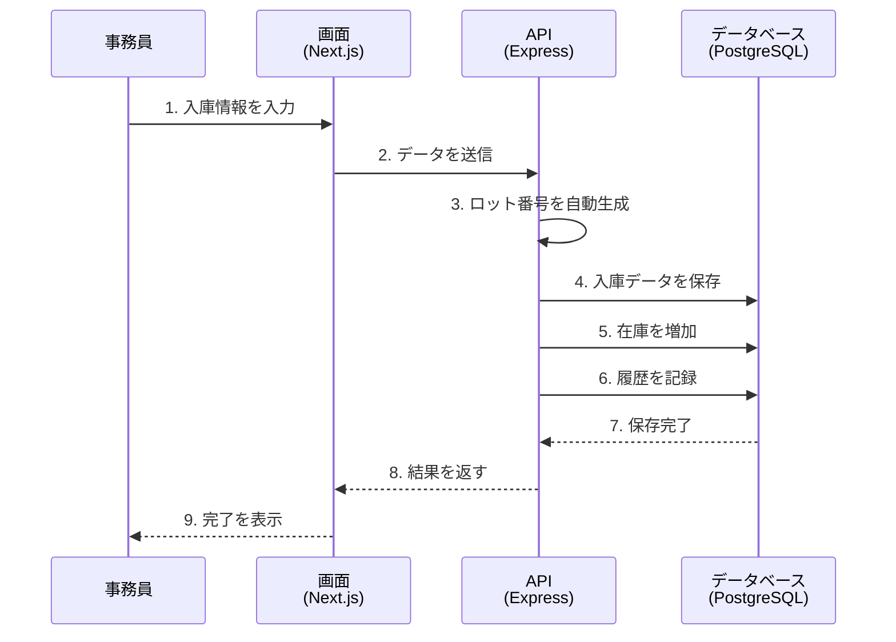
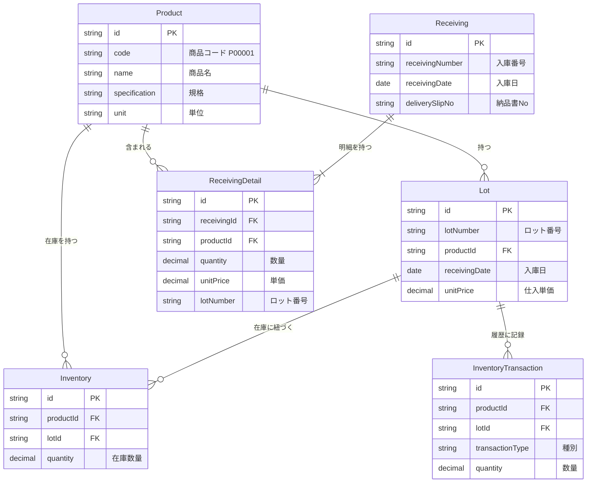
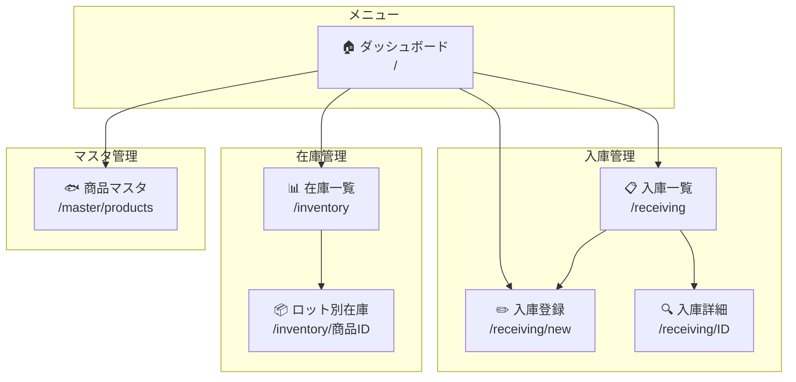

# 那覇魚類WMS システム設計ガイド

**〜 ズブの素人でもわかる設計の背景と仕組み 〜**

---

## 1. このシステムは何をするの？

### 現状の課題

```
┌─────────────────────────────────────────────────────────────┐
│                    😰 今までの作業                          │
├─────────────────────────────────────────────────────────────┤
│                                                             │
│   📄 納品書     →    📝 手書きメモ    →    📊 Excel入力    │
│                                                             │
│   ・転記ミスが起きやすい                                    │
│   ・在庫がリアルタイムでわからない                          │
│   ・ロット（入荷日ごとの管理）が難しい                      │
│   ・誰がいつ入力したか追えない                              │
│                                                             │
└─────────────────────────────────────────────────────────────┘
```

### このシステムで解決！

```
┌─────────────────────────────────────────────────────────────┐
│                    😊 新しい作業                            │
├─────────────────────────────────────────────────────────────┤
│                                                             │
│   📄 納品書     →    💻 WMS入力      →    ✅ 自動で完了！  │
│                                                             │
│   ・画面で入力するだけで在庫に反映                          │
│   ・ロット番号が自動で振られる                              │
│   ・いつでも在庫が確認できる                                │
│   ・履歴が全部残る                                          │
│                                                             │
└─────────────────────────────────────────────────────────────┘
```

---

## 2. システム全体像

### 三層構造（さんそうこうぞう）

このシステムは「3つの層」でできています。レストランに例えると...

```
┌────────────────────────────────────────────────────────────────────┐
│                                                                    │
│  🍽️  レストランに例えると...                                       │
│                                                                    │
│  ┌──────────────┐    ┌──────────────┐    ┌──────────────┐         │
│  │              │    │              │    │              │         │
│  │   お客さん   │    │   シェフ     │    │   冷蔵庫     │         │
│  │   (注文)     │ → │   (調理)     │ → │   (材料)     │         │
│  │              │    │              │    │              │         │
│  └──────────────┘    └──────────────┘    └──────────────┘         │
│         ↓                  ↓                   ↓                  │
│  ┌──────────────┐    ┌──────────────┐    ┌──────────────┐         │
│  │              │    │              │    │              │         │
│  │ フロントエンド│    │ バックエンド │    │ データベース │         │
│  │   (画面)     │ → │   (処理)     │ → │   (保存)     │         │
│  │              │    │              │    │              │         │
│  │  Next.js     │    │  Express     │    │ PostgreSQL   │         │
│  │              │    │              │    │              │         │
│  └──────────────┘    └──────────────┘    └──────────────┘         │
│                                                                    │
│  localhost:3000       localhost:3001       localhost:5432          │
│                                                                    │
└────────────────────────────────────────────────────────────────────┘
```

### なぜ分けるの？

```
┌─────────────────────────────────────────────────────────────┐
│  🤔 分ける理由                                              │
├─────────────────────────────────────────────────────────────┤
│                                                             │
│  1️⃣  役割分担でシンプルに                                   │
│      → 画面担当・処理担当・保存担当で分業                   │
│                                                             │
│  2️⃣  修正が楽                                               │
│      → 画面を変えても、処理側は触らなくてOK                 │
│                                                             │
│  3️⃣  チームで開発しやすい                                   │
│      → 画面チームと処理チームが同時に作業できる             │
│                                                             │
└─────────────────────────────────────────────────────────────┘
```

---

## 3. 技術スタックの説明

### 使っている技術（料理道具みたいなもの）

```
┌─────────────────────────────────────────────────────────────────────┐
│                        🛠️ 技術スタック                              │
├─────────────────────────────────────────────────────────────────────┤
│                                                                     │
│  ┌─────────────────────────────────────────────────────────────┐   │
│  │ 📱 フロントエンド（画面）                                    │   │
│  ├─────────────────────────────────────────────────────────────┤   │
│  │                                                             │   │
│  │  Next.js     → Webページを作るフレームワーク               │   │
│  │               （Reactという技術がベース）                   │   │
│  │                                                             │   │
│  │  Tailwind    → 見た目を整えるCSS                           │   │
│  │  CSS           （ボタンの色とか文字の大きさとか）           │   │
│  │                                                             │   │
│  │  TypeScript  → JavaScriptの進化版                          │   │
│  │               （ミスを事前に防いでくれる）                   │   │
│  │                                                             │   │
│  └─────────────────────────────────────────────────────────────┘   │
│                              ↓ データのやりとり                    │
│  ┌─────────────────────────────────────────────────────────────┐   │
│  │ ⚙️ バックエンド（処理）                                      │   │
│  ├─────────────────────────────────────────────────────────────┤   │
│  │                                                             │   │
│  │  Express     → サーバーを作るフレームワーク                │   │
│  │               （リクエストを受けて処理する）                 │   │
│  │                                                             │   │
│  │  Prisma      → データベースとの橋渡し役                    │   │
│  │               （SQLを書かなくてもデータ操作できる）          │   │
│  │                                                             │   │
│  │  TypeScript  → こちらもTypeScriptで統一                    │   │
│  │                                                             │   │
│  └─────────────────────────────────────────────────────────────┘   │
│                              ↓ データの保存・取得                  │
│  ┌─────────────────────────────────────────────────────────────┐   │
│  │ 🗄️ データベース（保存）                                      │   │
│  ├─────────────────────────────────────────────────────────────┤   │
│  │                                                             │   │
│  │  PostgreSQL  → データを保存する倉庫                        │   │
│  │               （商品情報、在庫数、入庫履歴など）             │   │
│  │                                                             │   │
│  │  Docker      → PostgreSQLを動かす箱                        │   │
│  │               （PCを汚さずに動かせる）                       │   │
│  │                                                             │   │
│  └─────────────────────────────────────────────────────────────┘   │
│                                                                     │
└─────────────────────────────────────────────────────────────────────┘
```

---

## 4. データの流れ

### 入庫登録の流れ



### 図で見る流れ

```
┌─────────────────────────────────────────────────────────────────────┐
│                      📦 入庫登録の流れ                              │
└─────────────────────────────────────────────────────────────────────┘

   👩‍💼 事務員さん
      │
      │ ① 納品書を見ながら入力
      │    ・入庫日: 2026/01/29
      │    ・商品: マグロ（本マグロ）
      │    ・数量: 50kg
      │    ・単価: 3,000円
      ▼
┌──────────────┐
│   📱 画面    │
│  (Next.js)   │
└──────┬───────┘
       │ ② HTTPリクエスト（POST）
       │    データをJSON形式で送信
       ▼
┌──────────────┐
│   ⚙️ API     │  ③ ロット番号を自動生成
│  (Express)   │     → "20260129-P00001-001"
└──────┬───────┘
       │ ④ データベースに保存
       │
       ▼
┌──────────────────────────────────────────────────────┐
│                    🗄️ データベース                    │
├──────────────────────────────────────────────────────┤
│                                                      │
│   📋 receivings（入庫）テーブル                      │
│   ┌────────────────────────────────────────────┐    │
│   │ 入庫番号: RCV-20260129-001                 │    │
│   │ 入庫日: 2026/01/29                         │    │
│   └────────────────────────────────────────────┘    │
│              ↓ 関連付け                              │
│   📋 receiving_details（入庫明細）テーブル           │
│   ┌────────────────────────────────────────────┐    │
│   │ 商品: P00001                               │    │
│   │ 数量: 50kg                                 │    │
│   │ 単価: 3,000円                              │    │
│   │ ロット: 20260129-P00001-001                │    │
│   └────────────────────────────────────────────┘    │
│              ↓ 在庫更新                              │
│   📋 inventories（在庫）テーブル                     │
│   ┌────────────────────────────────────────────┐    │
│   │ 商品: P00001                               │    │
│   │ ロット: 20260129-P00001-001                │    │
│   │ 数量: 50kg ← 増加！                        │    │
│   └────────────────────────────────────────────┘    │
│                                                      │
└──────────────────────────────────────────────────────┘
```

---

## 5. データベース設計

### テーブルの関係図（ER図）



### テーブルの役割（簡単な説明）

```
┌─────────────────────────────────────────────────────────────────────┐
│                      📊 テーブル一覧                                │
├─────────────────────────────────────────────────────────────────────┤
│                                                                     │
│  ┌─────────────────┐                                               │
│  │ 🐟 Product      │ ← 商品マスタ（商品の基本情報）                │
│  │   商品マスタ    │   例: P00001, マグロ（本マグロ）, kg          │
│  └─────────────────┘                                               │
│           │                                                         │
│           │ 1つの商品に複数のロットがある                          │
│           ▼                                                         │
│  ┌─────────────────┐                                               │
│  │ 📦 Lot          │ ← ロット（入荷ごとの識別）                    │
│  │   ロット        │   例: 20260129-P00001-001, 3000円/kg          │
│  └─────────────────┘                                               │
│           │                                                         │
│           │ ロットごとに在庫数がある                                │
│           ▼                                                         │
│  ┌─────────────────┐                                               │
│  │ 📊 Inventory    │ ← 在庫（今ある数量）                          │
│  │   在庫          │   例: P00001 + ロット001 = 50kg               │
│  └─────────────────┘                                               │
│                                                                     │
│  ─────────────────────────────────────────────────────────────     │
│                                                                     │
│  ┌─────────────────┐    ┌─────────────────┐                        │
│  │ 📝 Receiving    │───→│ 📋 Detail       │                        │
│  │   入庫ヘッダー  │    │   入庫明細      │                        │
│  │                 │    │                 │                        │
│  │ 入庫番号        │    │ 商品, 数量      │                        │
│  │ 入庫日          │    │ 単価, ロット    │                        │
│  │ 納品書No        │    │                 │                        │
│  └─────────────────┘    └─────────────────┘                        │
│                                                                     │
│  ┌─────────────────┐                                               │
│  │ 📜 Transaction  │ ← 在庫移動履歴（監査証跡）                    │
│  │   履歴          │   いつ、何が、どれだけ動いたか                │
│  └─────────────────┘                                               │
│                                                                     │
└─────────────────────────────────────────────────────────────────────┘
```

### なぜロットで管理するの？

```
┌─────────────────────────────────────────────────────────────────────┐
│                     🎯 ロット管理のメリット                         │
├─────────────────────────────────────────────────────────────────────┤
│                                                                     │
│  ❌ ロット管理なしの場合                                            │
│  ┌─────────────────────────────────────────────────────────────┐   │
│  │  マグロの在庫: 100kg                                        │   │
│  │                                                             │   │
│  │  → いつ入荷した分？                                         │   │
│  │  → 単価はいくら？                                           │   │
│  │  → 古い順に出荷したい時どうする？                           │   │
│  └─────────────────────────────────────────────────────────────┘   │
│                                                                     │
│  ✅ ロット管理ありの場合                                            │
│  ┌─────────────────────────────────────────────────────────────┐   │
│  │  マグロの在庫:                                              │   │
│  │                                                             │   │
│  │  📦 ロット20260125-P00001-001: 30kg（単価2,800円）          │   │
│  │  📦 ロット20260128-P00001-001: 50kg（単価3,000円）          │   │
│  │  📦 ロット20260129-P00001-001: 20kg（単価3,200円）          │   │
│  │                                                             │   │
│  │  → 古い順に出荷できる（先入れ先出し）                       │   │
│  │  → 原価計算が正確にできる                                   │   │
│  │  → 問題があった時にどの入荷分か追跡できる                   │   │
│  └─────────────────────────────────────────────────────────────┘   │
│                                                                     │
└─────────────────────────────────────────────────────────────────────┘
```

---

## 6. 画面構成

### 画面遷移図



### 画面の役割

```
┌─────────────────────────────────────────────────────────────────────┐
│                        🖥️ 画面一覧                                  │
├─────────────────────────────────────────────────────────────────────┤
│                                                                     │
│  🏠 ダッシュボード (/)                                              │
│  └─ 各機能へのショートカット                                        │
│                                                                     │
│  ─────────────────────────────────────────────────────────────     │
│                                                                     │
│  📦 入庫管理                                                        │
│  │                                                                  │
│  ├─ 📋 入庫一覧 (/receiving)                                       │
│  │   └─ 過去の入庫履歴を確認                                        │
│  │                                                                  │
│  ├─ ✏️ 入庫登録 (/receiving/new)  ⭐ メイン画面                     │
│  │   └─ 納品書を見ながら入庫情報を入力                              │
│  │                                                                  │
│  └─ 🔍 入庫詳細 (/receiving/[id])                                  │
│      └─ 特定の入庫の詳細を確認                                      │
│                                                                     │
│  ─────────────────────────────────────────────────────────────     │
│                                                                     │
│  📊 在庫管理                                                        │
│  │                                                                  │
│  ├─ 📊 在庫一覧 (/inventory)                                       │
│  │   └─ 商品ごとの在庫数量を確認                                    │
│  │                                                                  │
│  └─ 📦 ロット別在庫 (/inventory/[productId])                       │
│      └─ 特定商品のロット別在庫を確認                                │
│                                                                     │
│  ─────────────────────────────────────────────────────────────     │
│                                                                     │
│  ⚙️ マスタ管理                                                      │
│  │                                                                  │
│  └─ 🐟 商品マスタ (/master/products)                               │
│      └─ 商品の登録・削除                                            │
│                                                                     │
└─────────────────────────────────────────────────────────────────────┘
```

---

## 7. ディレクトリ構造

### バックエンドの構造

```
┌─────────────────────────────────────────────────────────────────────┐
│                   📁 backend/ の構造                                │
├─────────────────────────────────────────────────────────────────────┤
│                                                                     │
│  backend/                                                           │
│  │                                                                  │
│  ├── 📁 prisma/          ← データベース関連                        │
│  │   ├── schema.prisma   ← テーブル定義（設計図）                  │
│  │   └── seed.ts         ← 初期データ投入                          │
│  │                                                                  │
│  └── 📁 src/             ← ソースコード                            │
│      │                                                              │
│      ├── index.ts        ← エントリーポイント（起動ファイル）       │
│      │                                                              │
│      ├── 📁 routes/      ← URLとの対応付け                         │
│      │   │                 「/api/products にアクセスしたら         │
│      │   │                  productController を呼ぶ」              │
│      │   ├── productRoutes.ts                                       │
│      │   ├── receivingRoutes.ts                                     │
│      │   └── inventoryRoutes.ts                                     │
│      │                                                              │
│      ├── 📁 controllers/ ← リクエストの受付係                      │
│      │   │                 「リクエストを受けて、                   │
│      │   │                  サービスに仕事を依頼」                  │
│      │   ├── productController.ts                                   │
│      │   ├── receivingController.ts                                 │
│      │   └── inventoryController.ts                                 │
│      │                                                              │
│      ├── 📁 services/    ← ビジネスロジック担当                    │
│      │   │                 「実際の処理を行う」                      │
│      │   │                 「ロット番号の生成など」                  │
│      │   ├── productService.ts                                      │
│      │   ├── receivingService.ts                                    │
│      │   ├── inventoryService.ts                                    │
│      │   └── lotService.ts                                          │
│      │                                                              │
│      └── 📁 repositories/ ← データベース操作担当                   │
│          │                  「データの保存・取得を行う」            │
│          ├── productRepository.ts                                   │
│          ├── receivingRepository.ts                                 │
│          ├── inventoryRepository.ts                                 │
│          ├── lotRepository.ts                                       │
│          └── transactionRepository.ts                               │
│                                                                     │
└─────────────────────────────────────────────────────────────────────┘
```

### なぜこんなに分けるの？

```
┌─────────────────────────────────────────────────────────────────────┐
│                   🏢 会社の部署に例えると...                        │
├─────────────────────────────────────────────────────────────────────┤
│                                                                     │
│   Routes       = 受付      「お客様を担当部署に案内」               │
│   Controllers  = 窓口担当  「要望を聞いて、適切な部署に依頼」       │
│   Services     = 業務担当  「実際に仕事をする」                     │
│   Repositories = 倉庫番    「書類（データ）の出し入れ」             │
│                                                                     │
│   ┌────────┐    ┌────────┐    ┌────────┐    ┌────────┐            │
│   │ Routes │ →  │Control-│ →  │Services│ →  │Repos-  │            │
│   │        │    │lers    │    │        │    │itories │            │
│   └────────┘    └────────┘    └────────┘    └────────┘            │
│     受付         窓口担当      業務担当       倉庫番                │
│                                                                     │
│   メリット:                                                         │
│   ・各部署が自分の仕事に集中できる                                  │
│   ・問題が起きた時に原因を特定しやすい                              │
│   ・部署ごとに担当者を変えられる（チーム開発しやすい）              │
│                                                                     │
└─────────────────────────────────────────────────────────────────────┘
```

### フロントエンドの構造

```
┌─────────────────────────────────────────────────────────────────────┐
│                   📁 frontend/ の構造                               │
├─────────────────────────────────────────────────────────────────────┤
│                                                                     │
│  frontend/                                                          │
│  └── 📁 src/                                                        │
│      │                                                              │
│      ├── 📁 app/              ← ページ（URLに対応）                │
│      │   │                                                          │
│      │   ├── page.tsx         ← / (ダッシュボード)                 │
│      │   ├── layout.tsx       ← 共通レイアウト                     │
│      │   │                                                          │
│      │   ├── 📁 receiving/    ← /receiving                         │
│      │   │   ├── page.tsx     ← 入庫一覧                           │
│      │   │   ├── 📁 new/                                           │
│      │   │   │   └── page.tsx ← 入庫登録                           │
│      │   │   └── 📁 [id]/                                          │
│      │   │       └── page.tsx ← 入庫詳細                           │
│      │   │                                                          │
│      │   ├── 📁 inventory/    ← /inventory                         │
│      │   │   ├── page.tsx     ← 在庫一覧                           │
│      │   │   └── 📁 [productId]/                                   │
│      │   │       └── page.tsx ← ロット別在庫                       │
│      │   │                                                          │
│      │   └── 📁 master/                                            │
│      │       └── 📁 products/                                      │
│      │           └── page.tsx ← 商品マスタ                         │
│      │                                                              │
│      ├── 📁 components/       ← 部品（再利用可能）                 │
│      │   ├── Sidebar.tsx      ← サイドメニュー                     │
│      │   ├── Button.tsx       ← ボタン                             │
│      │   ├── Input.tsx        ← 入力欄                             │
│      │   ├── Table.tsx        ← テーブル                           │
│      │   ├── Card.tsx         ← カード                             │
│      │   └── ProductSearch.tsx ← 商品検索                          │
│      │                                                              │
│      ├── 📁 lib/              ← ユーティリティ                     │
│      │   └── api.ts           ← API呼び出し                        │
│      │                                                              │
│      └── 📁 types/            ← 型定義                             │
│          └── index.ts         ← データの形を定義                   │
│                                                                     │
└─────────────────────────────────────────────────────────────────────┘
```

---

## 8. 自動採番の仕組み

### 商品コード

```
┌─────────────────────────────────────────────────────────────────────┐
│                   🔢 商品コードの自動採番                           │
├─────────────────────────────────────────────────────────────────────┤
│                                                                     │
│   形式: P + 5桁の数字                                               │
│                                                                     │
│   P 00001  →  P 00002  →  P 00003  → ... →  P 99999                │
│   └─┬──┘                                                            │
│     └── 最大99,999種類まで対応                                      │
│                                                                     │
│   仕組み:                                                           │
│   ┌─────────────────────────────────────────────────────────────┐   │
│   │ 1. 既存の最大コードを取得  → P00015                        │   │
│   │ 2. 数字部分を取り出す      → 00015 → 15                    │   │
│   │ 3. 1を足す                 → 16                            │   │
│   │ 4. 5桁にゼロ埋め           → 00016                         │   │
│   │ 5. Pを付ける               → P00016                        │   │
│   └─────────────────────────────────────────────────────────────┘   │
│                                                                     │
└─────────────────────────────────────────────────────────────────────┘
```

### ロット番号

```
┌─────────────────────────────────────────────────────────────────────┐
│                   🔢 ロット番号の自動採番                           │
├─────────────────────────────────────────────────────────────────────┤
│                                                                     │
│   形式: 入庫日 - 商品コード - 連番                                  │
│                                                                     │
│   20260129 - P00001 - 001                                           │
│   └──┬───┘  └──┬──┘  └─┬─┘                                         │
│      │         │       └── 同日・同商品での連番                     │
│      │         └────────── 商品コード                               │
│      └──────────────────── 入庫日（YYYYMMDD）                       │
│                                                                     │
│   例:                                                               │
│   ┌─────────────────────────────────────────────────────────────┐   │
│   │ 2026/01/29 にマグロ(P00001)を3回入庫した場合:               │   │
│   │                                                             │   │
│   │  1回目 → 20260129-P00001-001                                │   │
│   │  2回目 → 20260129-P00001-002                                │   │
│   │  3回目 → 20260129-P00001-003                                │   │
│   └─────────────────────────────────────────────────────────────┘   │
│                                                                     │
└─────────────────────────────────────────────────────────────────────┘
```

### 入庫番号

```
┌─────────────────────────────────────────────────────────────────────┐
│                   🔢 入庫番号の自動採番                             │
├─────────────────────────────────────────────────────────────────────┤
│                                                                     │
│   形式: RCV - 入庫日 - 連番                                         │
│                                                                     │
│   RCV - 20260129 - 001                                              │
│   └┬┘  └───┬───┘  └─┬─┘                                            │
│    │       │        └── その日の連番                                │
│    │       └─────────── 入庫日（YYYYMMDD）                          │
│    └─────────────────── Receiving（入庫）の略                       │
│                                                                     │
└─────────────────────────────────────────────────────────────────────┘
```

---

## 9. まとめ

```
┌─────────────────────────────────────────────────────────────────────┐
│                        📝 まとめ                                    │
├─────────────────────────────────────────────────────────────────────┤
│                                                                     │
│  ✅ このシステムでできること                                        │
│     ・商品の登録・管理                                              │
│     ・入庫情報の登録                                                │
│     ・ロット番号の自動生成                                          │
│     ・在庫のリアルタイム確認                                        │
│     ・ロット別の在庫確認                                            │
│     ・入庫履歴の確認                                                │
│                                                                     │
│  🏗️ 設計のポイント                                                  │
│     ・三層構造で役割分担（画面・処理・データ）                      │
│     ・ロット管理で正確な在庫把握                                    │
│     ・自動採番で入力ミス防止                                        │
│     ・履歴テーブルで監査対応                                        │
│                                                                     │
│  🔮 今後の拡張                                                      │
│     ・出庫機能                                                      │
│     ・加工処理                                                      │
│     ・在庫調整                                                      │
│     ・レポート出力                                                  │
│     ・ユーザー認証                                                  │
│                                                                     │
└─────────────────────────────────────────────────────────────────────┘
```

---

**作成日**: 2026年1月29日
